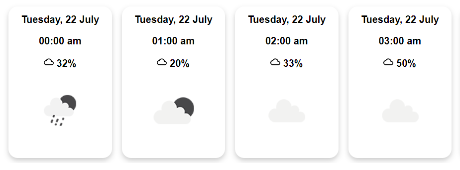

# Vue 3 + OpenWeather


## Install

### NPM

```
npm i vue-openweather
```

## OpenWeatherAPI

Get an OpenWeatherAPI key by signing up an account at the OpenWeather website

## Usage
```html
<script setup lang="ts">
  import { VueOpenWeather } from "vue-openweather"
  import "vue-openweather/dist/style.css"
<script>

<template>
  <VueOpenWeather 
    apiKey="your-open-weather-api-key"
    lat="your-latitude"
    long="your-longitude"
    hourly
  />
</template>
```

## Props

| Props       | Type               | Default Value    | Description                |
|-------------|--------------------|------------------|----------------------------|
| apiKey      | string (required)  | -                | Your API key               |
| lat         | string (required)  | -                | Your latitude              |
| long        | string (required)  | -                | Your longitude             |
| hourly      | boolean            | false            | Hourly data for 48 hours   |
| daily       | boolean            | daily            | Daily data for 3 days      |
| units       | string             | metric           | Metric or Imperial units   |